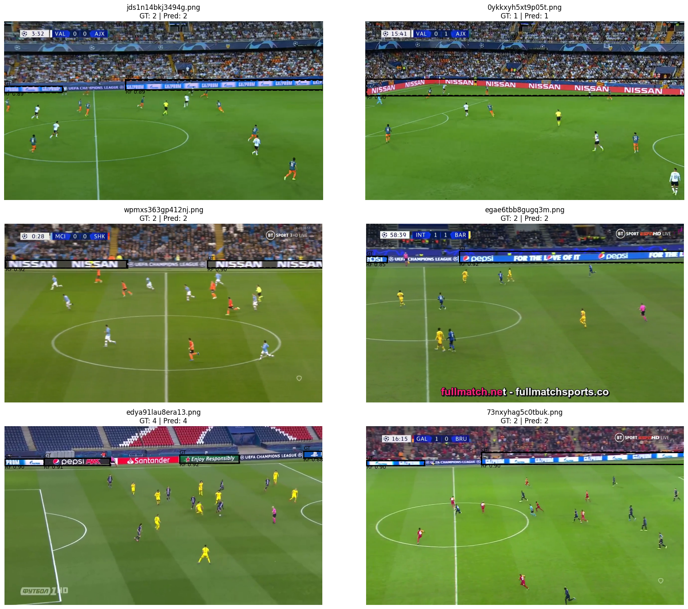
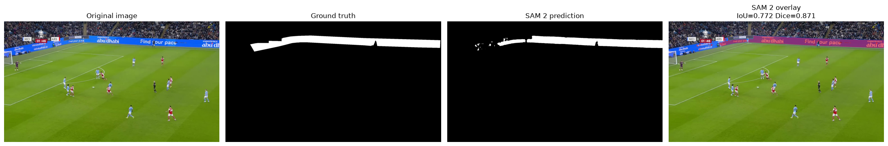
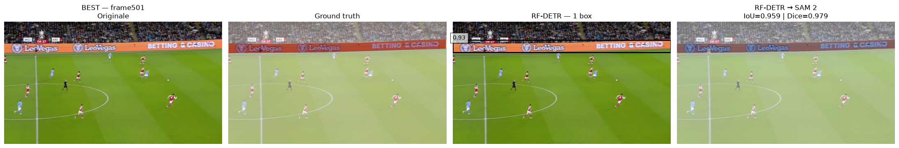

# Deep Learning-Based Advertising-Board Segmentation in Soccer Images

Progetto sviluppato per il corso di Deep Learning con l'obiettivo di localizzare e segmentare automaticamente i pannelli pubblicitari presenti nelle immagini di partite di calcio.

## Pipeline

La pipeline proposta combina RF-DETR per la object detection e SAM 2 per la segmentazione pixel-level:

```text
Football frame
      ↓
   RF-DETR
      ↓
Bounding boxes
      ↓
    SAM 2
      ↓
Segmentation mask
```

RF-DETR localizza i pannelli pubblicitari mediante bounding box, utilizzate successivamente come prompt per SAM 2.

Il progetto analizza inoltre la qualità delle annotazioni, la generalizzazione tra dataset differenti e la propagazione degli errori tra detector e segmentatore.

---

## Dataset

Sono stati utilizzati due dataset distinti per detection e segmentation.

### Detection dataset

Il dataset contiene 8.851 immagini. Le sei categorie originali di sponsor sono state accorpate nella singola classe:

```text
advertising_board
```

Dopo la conversione delle annotazioni Supervisely in formato COCO e il preprocessing sono state ottenute 19.146 bounding box valide.

| Split | Images | Annotations |
|---|---:|---:|
| Train | 6.196 | 13.349 |
| Validation | 1.328 | 2.858 |
| Test | 1.327 | 2.939 |
| **Total** | **8.851** | **19.146** |


### Segmentation dataset

Il dataset utilizzato per SAM 2 contiene:

- 1.620 immagini annotate;
- 1.620 ground-truth masks.

Sono stati verificati pairing, dimensioni e integrità delle maschere. Tutte le maschere contengono una singola componente foreground connessa.

I dataset non sono inclusi nel repository.

---

## RF-DETR

Per la detection è stato utilizzato **RF-DETR Nano**, inizializzato da pesi pre-addestrati e successivamente sottoposto a fine-tuning.

### Training configuration

| Parameter | Value |
|---|---:|
| Resolution | 384 |
| Epochs | 5 |
| Batch size | 4 |
| Gradient accumulation | 4 |
| Effective batch size | 16 |

Il training è stato eseguito su Google Colab con GPU NVIDIA T4.

### Original test set

| Metric | Value |
|---|---:|
| mAP@50:95 | **0.8797** |
| mAP@50 | 0.9883 |
| mAP@75 | 0.9786 |
| mAR@500 | 0.9194 |
| F1 | 0.9869 |
| Precision | 0.9871 |
| Recall | 0.9867 |

---

### Qualitative detection results

Alcuni esempi qualitativi mostrano il confronto tra le bounding box della ground truth e le predizioni prodotte da RF-DETR.




## Annotation review

L'analisi qualitativa ha evidenziato la presenza di pannelli pubblicitari visibili ma non rappresentati nella ground truth originale.

È stato quindi revisionato manualmente un sottoinsieme casuale di 100 immagini del test set:

```text
Original annotations: 217
Revised annotations:  338
Added annotations:    121
```

Le annotazioni aumentano del 55,8% nel subset revisionato.

Lo stesso checkpoint RF-DETR è stato valutato sulle stesse immagini utilizzando le due ground truth:

| Metric | Original GT | Revised GT |
|---|---:|---:|
| mAP@50:95 | 0.8880 | 0.5804 |
| mAP@50 | 1.0000 | 0.7098 |
| mAP@75 | 0.9816 | 0.6419 |
| mAR | 0.9300 | 0.6781 |
| F1 | 0.9977 | 0.7828 |
| Precision | 0.9954 | 0.9954 |
| Recall | 1.0000 | 0.6450 |

La precision rimane sostanzialmente invariata, mentre il recall diminuisce sensibilmente. Il confronto evidenzia l'influenza del protocollo di annotazione sulla valutazione del detector.

---

## SAM 2

Per la segmentazione è stato utilizzato:

```text
facebook/sam2.1-hiera-small
```

senza fine-tuning specifico sul dominio calcistico.

Gli esperimenti sono stati eseguiti localmente su Apple Silicon tramite PyTorch MPS.

Sono state confrontate due configurazioni.

### Ground-truth bbox → SAM 2

Le bounding box vengono ricavate direttamente dalle ground-truth masks e utilizzate come prompt ideali.

| Metric | Value |
|---|---:|
| Mean IoU | **0.7834** |
| Median IoU | 0.8306 |
| Micro IoU | 0.7778 |
| Mean Dice | **0.8698** |
| Median Dice | 0.9075 |
| Micro Dice | 0.8750 |

#### Qualitative example

Esempio di segmentazione ottenuta da SAM 2 utilizzando una bounding box derivata direttamente dalla ground-truth mask.



### RF-DETR → SAM 2

Le bounding box vengono prodotte automaticamente da RF-DETR utilizzando una confidence threshold pari a `0.50`.

| Metric | Value |
|---|---:|
| Mean IoU | **0.5802** |
| Micro IoU | 0.5855 |
| Mean Dice | **0.6659** |
| Micro Dice | 0.7386 |

Il confronto mostra un degrado delle prestazioni quando il prompt ideale viene sostituito dalla detection automatica.

Alla soglia `0.50`, RF-DETR non produce detection in 227 dei 1.620 frame. Un'analisi diagnostica a soglie inferiori mostra tuttavia che 224 di questi 227 frame contengono almeno una proposta a confidence più bassa.

#### End-to-end qualitative example

Esempio di funzionamento della pipeline completa RF-DETR → SAM 2.




---

## Setup

Versione RF-DETR utilizzata:

```text
rfdetr==1.9.1
```


## Limitations

I principali limiti osservati riguardano:

- incompletezza delle annotazioni;
- domain shift tra detection e segmentation dataset;
- differenze nei contenuti pubblicitari tra i dataset;
- forte prospettiva e occlusioni;
- dipendenza di SAM 2 dalla qualità della bounding box;
- propagazione degli errori tra detection e segmentation.

---

## Conclusion

RF-DETR ottiene prestazioni elevate rispetto alle annotazioni originali, mentre la revisione manuale mostra quanto il protocollo della ground truth possa influenzare la valutazione.

SAM 2 produce buone segmentazioni quando riceve bounding box derivate dalla ground truth, mentre la pipeline end-to-end risente della qualità della localizzazione e del domain shift tra i dataset.

Il progetto evidenzia quindi l'importanza sia delle annotazioni sia dell'interazione tra i diversi stadi di una pipeline detector-segmenter.
